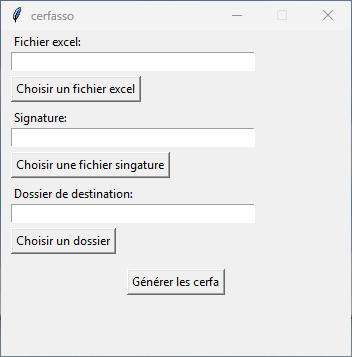

[](https://github.com/CommanderieCondat/cerfasso/actions/workflows/test_build_release.yml)
[](https://www.python.org/downloads/release/python-310/)
[](https://github.com/CommanderieCondat/cerfasso/releases/latest)
[](https://opensource.org/licenses/MIT)
# Cerfasso: Application de génération automatique de CERFA 2041-RD

Cerfasso est une application Python basée sur l'interface Tkinter, conçue pour générer automatiquement des formulaires CERFA 2041-RD (11580*05) pour la déduction fiscale des dons aux associations. L'application extrait les données nécessaires à partir d'un fichier Excel et génère des fichiers PDF prêts à l'emploi pour chaque donateur.



## Notice d'installation pour les utilisateurs Windows

### Installation de l'application

1. **Téléchargez le fichier d'installation**
   - Téléchargez le fichier d'installation [`cerfasso-installer.exe`](https://github.com/CommanderieCondat/cerfasso/releases/download/v0.1/cerfasso-installer.exe) en cliquant sur le lien ou bien en vous rendant sur la page des [releases](https://github.com/CommanderieCondat/cerfasso/releases) du dépôt.

2. **Lancez l'installateur**
   - Double-cliquez sur `cerfasso-installer.exe`.
   - Suivez les instructions de l'assistant d'installation.

3. **Démarrage de l'application**
   - Une fois l'installation terminée, lancez l'application depuis le raccourci sur le bureau ou le menu Démarrer.

---

### Utilisation de l'application

1. **Sélectionnez un fichier Excel** : Cliquez sur le bouton pour choisir un fichier contenant les informations de l'association et des donateurs, le fichier `dons_assos.xlsx` dans le dossier `assets` de ce dépôt sert d'exemple.
2. **Ajoutez une signature** : Choisissez une image de signature (au format PNG, JPG, etc.), l'application est calibrée pour des images de signature au format 350px*190px avec un fond transparent comme le fichier `signature.png` présent dans le dossier `assets` dans ce dépôt.
3. **Définissez un dossier de destination** : Spécifiez où enregistrer les CERFA générés.
4. **Générez les CERFA** : Cliquez sur le bouton pour lancer la génération. Les fichiers seront créés dans le dossier choisi.

---

## Structure du fichier Excel

Le fichier Excel doit contenir deux onglets nommés **"asso"** et **"dons"**.

⚠️ L'onglet **notice**  du fichier `dons_assos.xlsx` apporte des précisions quant aux types et formats de données à respecter dans le fichier xlsx. ⚠️


### Onglet `asso`
| **nom**         | **siren**   | **numero** | **rue**        | **codepostal** | **commune**  | **pays**       | **objet** | **statut** |
|-------------|---------|---------|------------|-------------|----------|------------|-------------------------|--------|
| nomdelasso  | 123 456 789 | 10      | Rue Exemple| 75000       | Paris    | France     | Objet exemple          | 1  |

### Onglet `dons`
| **nom**       | **prenom**    | **numero** | **rue**        | **codepostal** | **commune**  | **pays**       | **don**  | **datedon** | **forme** | **nature** | **mode** | **datecerfa** |
|-----------|-----------|---------|------------|-------------|----------|------------|------|-------------|-------|--------|------|------------|
| Smith   | Joe  | 10      | Rue machin | 75000       | Paris    | France     | 100  | 01/10/2024  | 1     | 1      | 1    | 02/01/2025 |
| Rose   | Pamela  | 1      | Rue truc | 75000       | Paris    | France     | 200  | 01/11/2024  | 1     | 2      | 3    | 02/01/2025 |


---

## Installation pour les développeurs

### Environnement requis

1. **Python 3.9+**
2. Les bibliothèques Python suivantes sont requises :
   - `tkinter`
   - `PyPDF2`
   - `reportlab`
   - `openpyxl`

### Installation

1. Clonez ce dépôt :
   ```bash
   git clone https://github.com/CommanderieCondat/cerfasso.git
   cd cerfator2
   ```

2. Installez les dépendances Python :
   ```bash
   pip install -r requirements.txt
   ```

3. Assurez-vous que le fichier modèle du CERFA (`2041-rd_4298.pdf`) est bien présent dans le dossier `assets`.

4. Lancez l'application :
   ```bash
   python src/cerfasso.py
   ```

---

### générer un exécutable

```shell
pyinstaller --windowed --add-data="assets/2041-rd_4298.pdf:assets/" src/cerfasso.py 
```

### générer un installeur windows

deux options sous windows: [Inno-Setup](https://jrsoftware.org/isinfo.php) ou [InstallForge](https://installforge.net/), la première est inlcue dans le workflow `test_build_release.yml` de ce dépôt mais l'installation pose problème, la seconde n'est pas disponible en action github et requiert donc une mise à jour manuelle du dépôt.


## Licence
Ce projet est sous licence [MIT](https://opensource.org/licenses/MIT).


# Create release
to create a new release, commit your changes and tag the commit with a version number, then push the tag to the remote repository.
```
git add .
git commit -m "commit message"
git tag v... -m "tag message"
git push origin v...
```